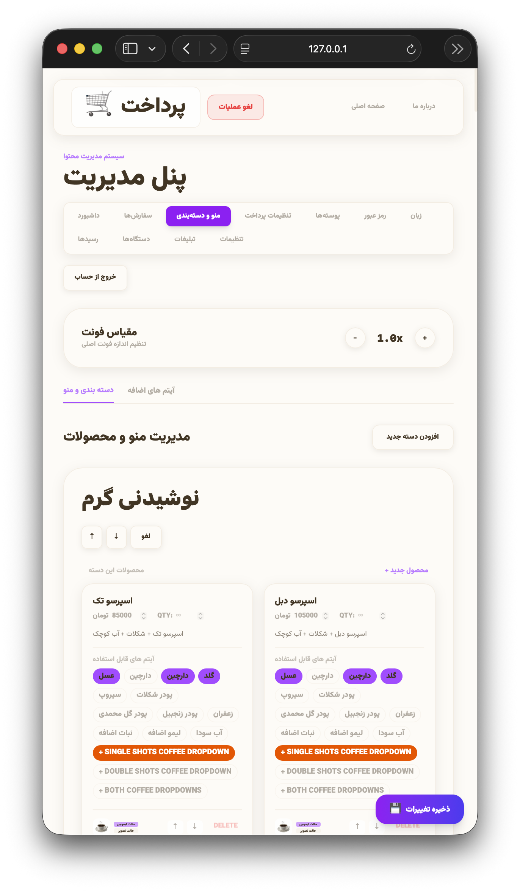
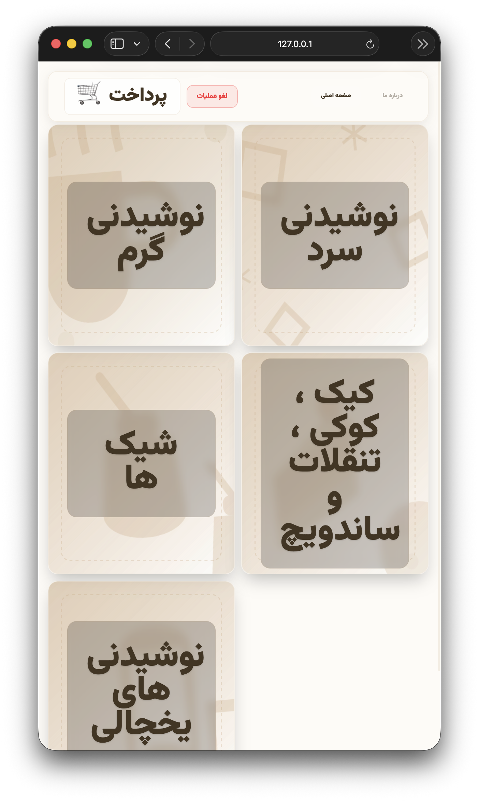
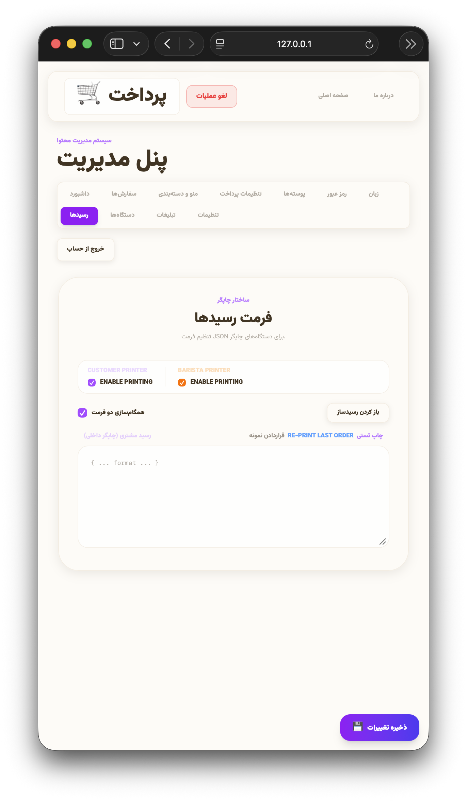
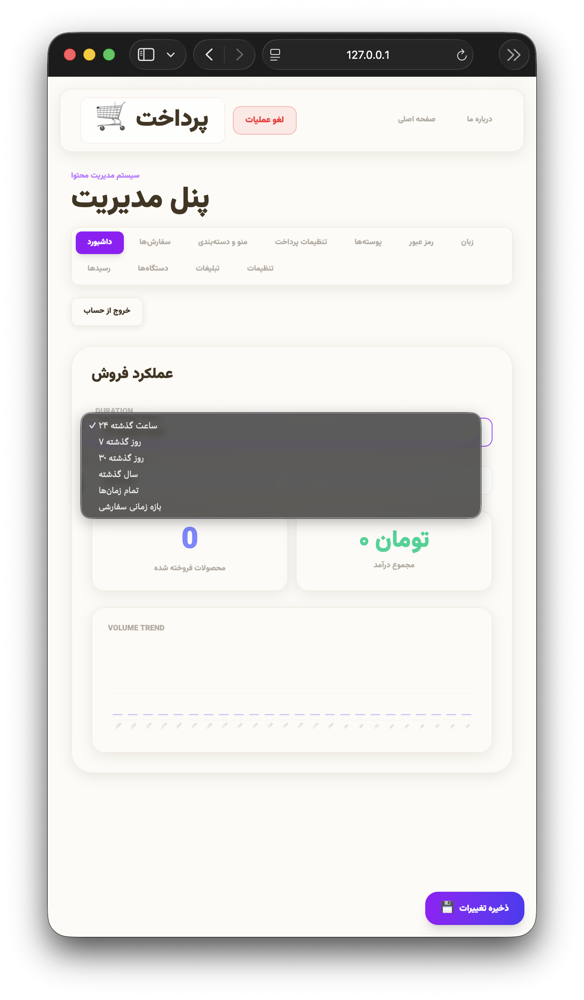
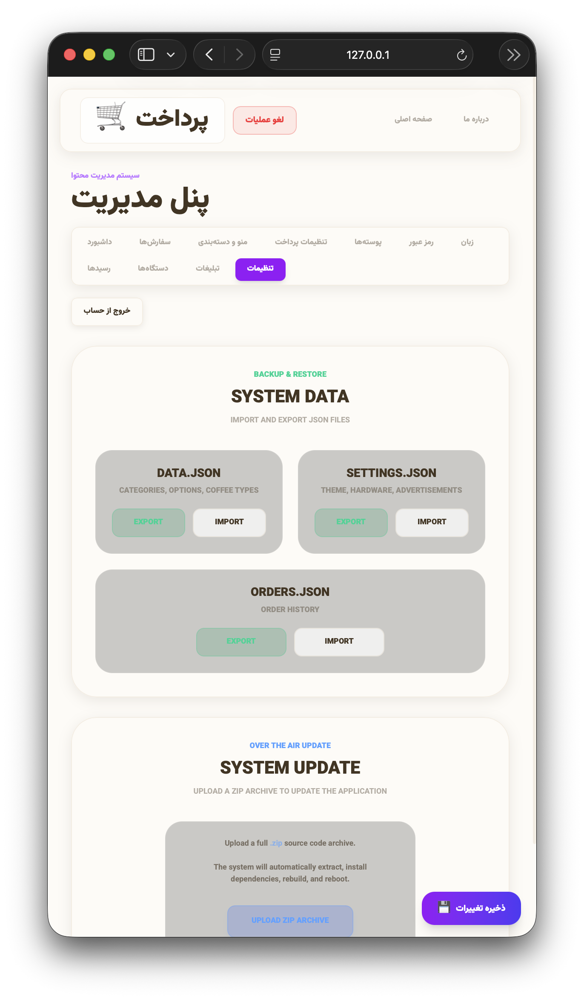
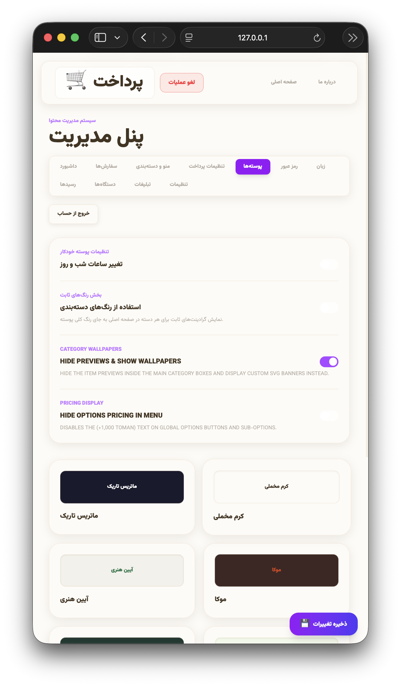

# سیستم جامع فروش و کیوسک سفارش‌دهی کافه

*[🇺🇸 Read this in English](README.md)*

یک نرم‌افزار پیشرفته، زیبا و کاربردی برای مدیریت فروش (POS) و کیوسک‌های سلف‌سرویس، که به طور اختصاصی برای کافه‌ها و رستوران‌ها طراحی شده است. این مخزن (ریپازیتوری) جهت **نمایش نمونه‌کار (Portfolio)** از توانمندی‌های توسعه فرانت‌اند، طراحی UI/UX و فول‌استک من ایجاد شده است.

این سیستم با استفاده از React، TypeScript و Tailwind CSS ساخته شده و دارای رابط کاربری مدرن (Glassmorphism)، پنل مدیریت جامع و سیستم شخصی‌سازی سفارشات بسیار دقیق است.

## 🌟 ویژگی‌های کلیدی

- **پشتیبانی کامل از دو زبان:** امکان تغییر سریع بین زبان‌های فارسی (راست‌چین RTL) و انگلیسی در تمامی بخش‌های برنامه.
- **شخصی‌سازی پیشرفته آیتم‌ها:** پشتیبانی از تنظیمات پیچیده قهوه (شات‌های سینگل/دبل، شیرهای گیاهی، انواع سیروپ) با منوهای آبشاری و وابستگی‌های هوشمند.
- **مدیریت موجودی در لحظه:** پیگیری موجودی انبار برای هر محصول و حتی گزینه‌های جانبی (مثل سیروپ‌ها). در صورت اتمام موجودی، سیستم به صورت خودکار از ثبت سفارش آن آیتم جلوگیری می‌کند.
- **رابط کاربری Glassmorphism:** طراحی بسیار مدرن، واکنش‌گرا (Responsive) با انیمیشن‌های روان و تم‌های رنگی متنوع.
- **حالت کیوسک سلف‌سرویس:** دارای سیستم پخش تبلیغات (Screensaver) در زمان‌هایی که دستگاه بدون استفاده رها می‌شود.

---

## 🎛️ امکانات پنل مدیریت (داشبورد)

این برنامه شامل یک پنل مدیریت بسیار پیشرفته و ایمن برای مدیران کافه است تا بدون نیاز به دانش برنامه‌نویسی، کل سیستم را کنترل کنند:

- **پیگیری زنده سفارشات:** مشاهده لحظه‌ای سفارشات ثبت‌شده، وضعیت پرداخت‌ها و مدیریت تحویل سفارش.
- **تحلیل بازار و آمار فروش:** 
  - نمودارهای بصری برای بررسی میزان کل درآمد و فروش در بازه‌های زمانی مختلف (روزانه، هفتگی، ماهانه و دلخواه).
  - جداول تحلیل دقیق که نشان می‌دهد هر گزینه جانبی، ساب‌آیتم و نوع قهوه دقیقاً چقدر فروش و درآمد داشته است.
- **مدیریت منو و انبار:** ویرایشگر کاملاً داینامیک برای ایجاد و مرتب‌سازی دسته‌بندی‌ها، محصولات و گزینه‌های جانبی (Global Options). مدیران می‌توانند قوانینی مثل اجباری بودن انتخاب نوع قهوه، ایجاد زیرمجموعه‌ها و محدودیت دقیق موجودی را اعمال کنند.
- **سیستم تولید و چاپ رسید داینامیک:** امکان شخصی‌سازی کامل قالب رسیدها با استفاده از تگ‌های پویا (شماره سفارش، تاریخ، قیمت‌ها، نام مشتری و غیره). مدیران می‌توانند چیدمان رسید را مستقیماً در داشبورد طراحی کنند. این بخش برای چاپ سریع و بی‌نقص روی پرینترهای حرارتی تحت شبکه (ESC/POS) با یک اسکریپت پایتون ارتباط برقرار می‌کند.
- **تنظیمات سیستم و سخت‌افزار:** مدیریت زمان‌بندی تبلیغات کیوسک، افزودن و پیکربندی پرینترهای حرارتی تحت شبکه (تنظیم IP و فعال/غیرفعال کردن چندین پرینتر)، و تغییر تم‌های ظاهری نرم‌افزار.

---

## 🛠️ تکنولوژی‌های استفاده شده

- **فرانت‌اند:** React 18, TypeScript, Vite
- **استایل‌دهی:** Tailwind CSS
- **بک‌اند:** Node.js, Express
- **آیکون‌ها:** Lucide React
- **ارتباط سخت‌افزاری:** اسکریپت‌های پایتون جهت اتصال سیستم تحت وب به پرینترهای حرارتی شبکه (ESC/POS).

---

## 📸 تصاویر محیط برنامه

> *(می‌توانید اسکرین‌شات‌های برنامه را در اینجا قرار دهید)*

| دسته‌بندی‌ها و منو | صفحه اصلی (کیوسک) |
| :---: | :---: |
|  |  |

| تنظیمات چاپ رسید | تب فروش و آمار |
| :---: | :---: |
|  |  |

| دیتای سیستم و بازیابی | تم‌های ظاهری |
| :---: | :---: |
|  |  |
